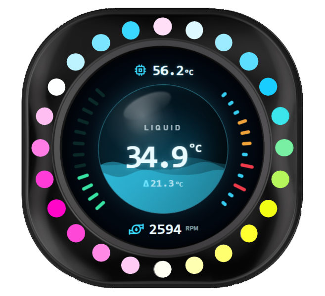
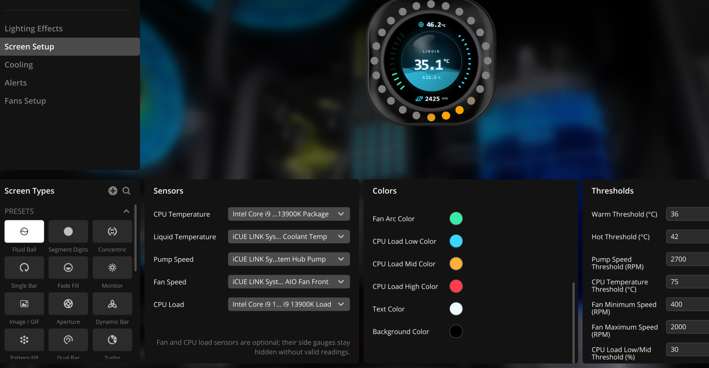

# Fluid Ball

Fluid Ball is a monitoring widget with liquid animation for the 480 × 480 circular Corsair iCUE Pump LCD. It allows users to monitor coolant temperature, CPU temperature, pump speed, and optionally fan speed, CPU load on a single display. Its design goal is to answer one question at a glance: is the cooling system running healthy?

<h1 align="center">
    
</h1>

## Features

- Three selectable sensors (coolant temperature, CPU temperature, pump speed) for digits display
- Two optional selectable sensors for fan speed and CPU load, showing as arc-shaped meter and histogram on sides
- Colors that indicate sensors status
- Configurable colors and sensor thresholds
- Liquid animation corresponding to pump speed, implemented with Canvas 2D
- Lower frame rate and static mode for compatibility

<h1 align="center">
    
</h1>

## Requirements

- Corsair iCUE 5.47 or later on Windows
- iCUE Widget Framework 1.4.0 or later
- Corsair Sensors Data Provider plugin (`widgetbuilder.sensorsdataprovider:Sensors:1.0`)
- A 480 × 480 circular Pump LCD (`pump_lcd`)

## Installation

1. Download `fluid-ball-v1.5.0.icuewidget` from the project release.
2. Remove an older Fluid Ball installation before importing a rebuilt package with the same version.
3. Open the package, add **Fluid Ball** to the LCD, and choose the sensors in iCUE.

## Development

Validate and package with the official CLI:

```powershell
pnpm dlx icuewidget-cli@0.4.47 validate .
pnpm dlx icuewidget-cli@0.4.47 package .
```

Release packages are created from a staging directory containing only the nine runtime files required by the widget.

## Third-Party Assets

`resources/chip.svg` and `resources/pump.svg` use artwork from Google Material Icons. Material Icons are provided by Google under the Apache License 2.0. See the [official Material Icons guide](https://developers.google.com/fonts/docs/material_icons) and the [Google Material Design Icons repository](https://github.com/google/material-design-icons).

## Known Issues

- When importing multiple versions of this widget into iCUE, it will display as two tabs under the same widget. Deleting this widget may result in crash of the iCUE software. To avoid this issue, delete the existing widget from iCUE before importing a new version. 
- In current version of iCUE (5.47), only the currently selected widget of a profile has persistent storage for its customizable values, which means all non-selected widgets (including pre-installed native widgets) will reset to defaults when switching away from the profile or closing iCUE. Keep the widget selected before leaving iCUE or switching profile to prevent loss of settings. 
- The CPU load histogram would reset when switching profiles or widgets. Also, the histograms on iCUE preview and the physical LCD may differ because they are independent webview instances. 

## Documentation

- [iCUE Widgets](https://docs.elgato.com/icue/widgets/)
- [Sensors Data Provider](https://docs.elgato.com/icue/widgets/references/plugins/sensors-data-provider/)
- [iCUE Widget Builder Skill](https://github.com/Corsair-Labs/icue-widget-builder/)

## License

This widget is licensed under the Apache License 2.0. You may use, modify, and redistribute this project, including for commercial purposes, subject to the terms of the license.
